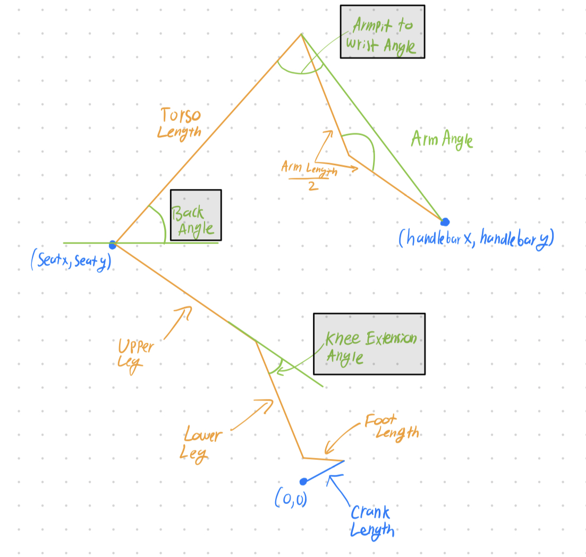

# ergo-bike
Includes tools to calculate and analyze the ergonomics of bike/body systems.

## Table of Contents
1. [Project Goals](#project-goals)
2. [Process and Methodology](#process-and-methodology)
3. [Usage and Documentation](#usage-and-documentation)
    1. [What are these dimensions and angles?](#what-are-these-dimensions-and-angles) 
    2. [Common Inputs](#common-inputs)
    3. [Most Useful Function Examples](#most-useful-function-examples)
    4. [Functions](#functions)
        1. [knee_extension_angle](#knee_extension_anglebike_vector-body_vector-ca)
        2. [back_armpit_angles](#back_armpit_anglesbike_vector-body_vector-arm_angle)
        3. [all_angles](#all_anglesbike_vector-body_vector-arm_angle)
        4. [prob_dists](#prob_distsbike_vector-body_vector-arm_angle-use="road")
        5. [all_noise](#all_noisebike_vector-body_vector-step_size-n)
        6. [analyze_folder](#analyze_folderfolder_path-users_dictionary)
        7. [print_analyze_table](#print_analyze_tableout)
        8. [print_analyze_images](#print_analyze_imagesout)


## Project Goals
1. Identify key factors for the ergonomics of a particular bike fit and their optimal ranges.
2. Provide tools to easily quantify and analyze the ergonomic performance of a given bike and body system and their intended use.
3. Integrate these tools with pose prediction software to speed up calculation, and provide tools to analyze the sensitivity and accuracy of the entire system.

## Process and Methodology
### 1. Identify key factors for the ergonomics of a particular bike fit and their optimal ranges.
1. Using "Bike Fit 2nd Edition" by Phil Burt and Chris Hoy as a reference, identified key factors of a unique bike fit to be the knee extension angle, back angle, and armpit to wrist angle.
    1. Knee extension angle is the angle between the upper and lower leg, measured at the knee, and is used to quantify the ergonomics of the saddle height.
    2. Back angle is the angle between the torso and horizontal plane and is used alongside the armpit to wrist angle to quantify the ergonomics of the handlebar height and reach of the bike.
2. Using the same reference, identified the optimal ranges of these factors. These correspond to the RETÜL bike fit system's reccomendations and are as follows:
    1. Knee extension angle: 45-30 degrees
    2. Back angle: 45-60 degrees
    3. Armpit to wrist angle: 80-100 degrees
### 2. Provide tools to easily quantify and analyze the ergonomic performance of a given bike and body system and their intended use.
1. Represented a bike and body system as a series of rigid bodies connected by joints. The bike is represented as 4 coordinates and the crank length (seat x, seat y, handelbar x, handelbar y, crank length). The body is represented as the dimensions of the body (lower leg, upper leg, torso length, arm length, foot length, ankle angle, arm angle).
    * The bike and body can be represented as two vectors.
2. Created a function to calculate the knee extension angle, back angle, and armpit to wrist angle of a given bike and body system. This function uses the law of cosines and other trigonometric functions to calculate these angles and to determine if a system violates the triangle inequality (not valid system).
3. Created a function to calculate the ergonomics of a given bike and body system. This function uses the angles calculated in the previous function and a usecase dictionary to determine the ergonomics of the system. The ergonomics are calculated by finding the distance between the angle and the optimal range as specified for the usecase in the usecase dictionary. The distance is then normalized by the optimal range to give a percentage of how close the angle is to the optimal range. 
### 3. Integrate these tools with pose prediction software to speed up calculation, and provide tools to analyze the sensitivity and accuracy of the entire system.
1. Created a function to calculate the dimensions of certain body parts given the height of the person which can be used to make a body vector.
2. Created a function to compare the predicted dimensions of the body to the actual dimensions of the body. This function can analyze all images in a certain file path following a naming format and can output a table to compare the predicted and actual dimensions.

## Usage and Documentation

### What are these dimensions and angles?


### Common Inputs
bike_vector: NumPy array in form [seat x, seat y, handlebar x, handlebar y, crank length].T

body_vector: NumPy array in form [lower leg, upper leg, torso length, arm length, foot length, ankle angle].T

arm_angle: Angle between the upper arm and lower arm at the elbow.

users_dictionary: Dictionary mapping user name to dictionary with body dimensions mapped to their name. See example below.
```
users_dictionary = {}
john_dictionary = {"height": 70, "torso": 28.3, "upleg": 15.5, "lowleg": 19., "arm": 21.25}
users_dictionary["john"] = john_dictionary
```

### Most Useful Function Examples
**all_angles and prob_dists**
```python
LL = 19
UL = 15.5
TL = 21
AL = 24
FL = 5.5
AA = deg_to_r(107)
body_4 = np.array([[LL, UL, TL, AL, FL, AA]]).T
bike_4 = np.array([[-9., 27, 16.5, 25.25, 7]]).T

print(all_angles(bike_4, body_4, 150))
>>> ### (knee extension angle, back angle, armpit to wrist angle)
>>>[45.40954825869782, 54.825079651532384, 70.49433849070087]

print(prob_dists(bike_4, body_4, 150))
>>>### (knee extension angle, back angle, armpit to wrist angle) probabilities
>>>(0.056835098630212744, 0.02470619689536746, 4.7871902035923064e-05)
```

**all_noise**
```python
body_4 = np.array([[LL, UL, TL, AL, FL, AA]]).T
bike_4 = np.array([[-9., 27, 16.5, 25.5, 7.]]).T

all_noise(bike_4, body_4, 2, 2)
>>> ### Noise table for each dimension of bike and body
>>> #*#*#*#*#*#*#*#*#*#*#*#*#*#*#*
#*#*#*#*# BIKE NOISE #*#*#*#*#
#*#*#*#*#*#*#*#*#*#*#*#*#*#*#*

 ***** Seat X Dimension *****
  Dim Value    Noise Amt    ke dif    back dif    awrist diff       ke     back    awrist
-----------  -----------  --------  ----------  -------------  -------  -------  --------
        -11           -2  -9.37977    -3.45231        6.50258  36.0298  51.9613   76.9462
         -9            0   0           0              0        45.4095  55.4136   70.4436
         -7            2   6.18105     3.34192       -6.25349  51.5906  58.7556   64.1901

 ***** Seat Y Dimension *****
  Dim Value    Noise Amt    ke dif    back dif    awrist diff        ke     back    awrist
-----------  -----------  --------  ----------  -------------  --------  -------  --------
         25           -2   17.7696     4.56148      -0.124946   63.1792  59.9751   70.3187
         27            0    0          0             0          45.4095  55.4136   70.4436
         29            2  nan         -4.80618       0.623295  nan       50.6075   71.0669

 ***** Handlebar X Dimension *****
  Dim Value    Noise Amt    ke dif    back dif    awrist diff       ke     back    awrist
-----------  -----------  --------  ----------  -------------  -------  -------  --------
       14.5           -2         0     3.34192       -6.25349  45.4095  58.7556   64.1901
       16.5            0         0     0              0        45.4095  55.4136   70.4436
       18.5            2         0    -3.45231        6.50258  45.4095  51.9613   76.9462

 ***** Handlebar Y Dimension *****
  Dim Value    Noise Amt    ke dif    back dif    awrist diff       ke     back    awrist
-----------  -----------  --------  ----------  -------------  -------  -------  --------
       23.5           -2         0    -4.80618       0.623295  45.4095  50.6075   71.0669
       25.5            0         0     0             0         45.4095  55.4136   70.4436
       27.5            2         0     4.56148      -0.124946  45.4095  59.9751   70.3187


#*#*#*#*#*#*#*#*#*#*#*#*#*#*#*
#*#*#*#*# BODY NOISE #*#*#*#*#
#*#*#*#*#*#*#*#*#*#*#*#*#*#*#*

 ***** Lower Leg Dimension *****
  Dim Value    Noise Amt    ke dif    back dif    awrist diff        ke     back    awrist
-----------  -----------  --------  ----------  -------------  --------  -------  --------
         17           -2  nan                0              0  nan       55.4136   70.4436
         19            0    0                0              0   45.4095  55.4136   70.4436
         21            2   16.0404           0              0   61.45    55.4136   70.4436

 ***** Upper Leg Dimension *****
  Dim Value    Noise Amt    ke dif    back dif    awrist diff        ke     back    awrist
-----------  -----------  --------  ----------  -------------  --------  -------  --------
       13.5           -2  nan                0              0  nan       55.4136   70.4436
       15.5            0    0                0              0   45.4095  55.4136   70.4436
       17.5            2   16.8556           0              0   62.2652  55.4136   70.4436

 ***** Torso Length Dimension *****
  Dim Value    Noise Amt    ke dif    back dif    awrist diff       ke     back    awrist
-----------  -----------  --------  ----------  -------------  -------  -------  --------
         19           -2         0     1.84858        3.34655  45.4095  57.2622   73.7902
         21            0         0     0              0        45.4095  55.4136   70.4436
         23            2         0    -2.01989       -3.28299  45.4095  53.3937   67.1606

 ***** Arm Length Dimension *****
  Dim Value    Noise Amt    ke dif    back dif    awrist diff       ke     back    awrist
-----------  -----------  --------  ----------  -------------  -------  -------  --------
         22           -2         0    -5.53067        3.95219  45.4095  49.883    74.3958
         24            0         0     0              0        45.4095  55.4136   70.4436
         26            2         0     5.6661        -3.86187  45.4095  61.0797   66.5817

 ***** Foot Length Dimension *****
  Dim Value    Noise Amt    ke dif    back dif    awrist diff       ke     back    awrist
-----------  -----------  --------  ----------  -------------  -------  -------  --------
        3.5           -2  -19.8783           0              0  25.5313  55.4136   70.4436
        5.5            0    0                0              0  45.4095  55.4136   70.4436
        7.5            2   15.1694           0              0  60.5789  55.4136   70.4436

 ***** Ankle Angle Dimension *****
  Dim Value    Noise Amt    ke dif    back dif    awrist diff        ke     back    awrist
-----------  -----------  --------  ----------  -------------  --------  -------  --------
  -0.132498           -2  nan                0              0  nan       55.4136   70.4436
   1.8675              0    0                0              0   45.4095  55.4136   70.4436
   3.8675              2   13.2436           0              0   58.6531  55.4136   70.4436
<ipython-input-1-340ef2c321d1>:114: RuntimeWarning: invalid value encountered in arccos
  alpha_1 = np.arccos((x_1**2 - UL_s - x_2**2) / (-2 * UL * x_2))
```

**analyze_folder**
```python
our_users = {}
noah_dict = {"height": 71, "torso": 21., "upleg": 15.5, "lowleg": 19., "arm": 24.}
faez_dict = {"height": 70, "torso": 28.3, "upleg": 15.5, "lowleg": 19., "arm": 21.25}
our_users["noah"]= noah_dict
our_users["faez"] = faez_dict

folder = "/content/drive/MyDrive/Bike Pose Detection Folder/Bright "
analyze_folder(folder, our_users)
>>> ### Table comparing predicted and actual dimensions
>>> file                pred torso    pred upleg    pred lowleg    pred arm    dtorso    dupleg    dlowleg      darm
----------------  ------------  ------------  -------------  ----------  --------  --------  ---------  --------
noah-spalmback         18.7244       19.1177        21.9539     22.2936  -2.27555   3.6177     2.95388  -1.70643
noah-dpalmback         18.8007       19.5824        21.9863     22.3149  -2.19927   4.08238    2.98634  -1.68509
noah-tpalmopen         19.0336       19.4478        21.7123     22.0601  -1.96645   3.9478     2.71234  -1.93986
noah-spalmopen         18.4177       19.4814        22.1035     22.4382  -2.58227   3.98137    3.1035   -1.56177
noah-tpalmback         19.0313       18.9803        21.9869     22.183   -1.96868   3.48031    2.98687  -1.81695
noah-spalmclosed       18.7351       19.0978        21.7393     22.1515  -2.2649    3.59779    2.73926  -1.84854
noah-dpalmclosed       18.8779       19.7853        21.7988     22.164   -2.12211   4.28531    2.79883  -1.83597
noah-tpalmclosed       18.5759       18.8976        21.64       22.0269  -2.42412   3.3976     2.64     -1.97308
```

## Functions
### bike_offset(bike_vector, thickness, setback)
**Description:**
Calculates the bike vector for a bike with a given seat thickness and setback.

**Input:**
* bike_vector
* thickness: Seat thickness
* setback: Seat setback distance

**Output:**
New bike vector with seat x and seat y adjusted for thickness and setback. Does not mutate input vector.

### knee_extension_angle(bike_vector, body_vector, CA)
**Description:**
Calculates knee extension angle for a given bike and body system and at a specific crank angle (CA)

**Input:**
bike_vector
body_vector
CA in **radians**

**Output:**
Knee extension angle in **radians** or None if inputs violate triangle inequality.

### back_armpit_angles(bike_vector, body_vector, arm_angle)
**Description:**
Calculates back angle and armpit to wrist angle for a given bike and body system and at a specific arm angle.

**Input:**
bike_vector
body_vector
arm_angle in **degrees**

**Output:**
Tuple of back angle in **radians** and armpit to wrist angle in **radians** or None if inputs violate triangle inequality.

### all_angles(bike_vector, body_vector, arm_angle)
**Description:**
* Uses knee_extension_angle and back_armpit_angles to produce one tuple corresponding to the minimum knee extension angle, back angle, and armpit to wrist angle. 
* Minimum knee extension angle is calculated on a [0, 2π] interval and returns None if it ever violates the triangle inequality (the bike body system cannot complete a full rotation of the cranks). 

**Input:**
bike_vector
body_vector
arm_angle in **degrees**

**Output:**
Tuple of minimum knee extension angle in **degrees**, back angle in **degrees**, and armpit to wrist angle in **degrees** or None if inputs violate triangle inequality for certain angle.

### prob_dists(bike_vector, body_vector, arm_angle, use="road")
**Description:**
Uses all angles and USE_DICT to calculate probabilities of the angles in the given bike and body system using Gaussian curve and CDF. Returns None for angles that are None.

**Input:**
bike_vector
body_vector
arm_angle in **degrees**
use: String corresponding to usecase in USE_DICT ("road", "mtb", "commute")

**Output:**
Tuple of probabilities of minimum knee extension angle, back angle, and armpit to wrist angle or None if inputs violate triangle inequality for certain angle.

### all_noise(bike_vector, body_vector, step_size, n)
**Description:**  
* Produces tables mapping noise in each dimension of the bike/body system to the respective change to knee extension angle, back angle, and armpit wrist angle.
* Produces “nan” if a test violated the triangle inequality.
* Note: arm_angle is defaulted to 150 degrees.

**Input:**
bike_vector
body_vector
step_size: Step size of noise in each dimension
n: Number of tests to run for each dimension

**Output:**
Prints noise table for each dimension of bike and body with 2n-1 rows in each table.

### analyze_folder(folder_path, users_dictionary)
**Description:**
* Analyzes all images in a folder and compares the predicted dimensions of the body to the actual dimensions of the body.
* Produces a table comparing the predicted and actual dimensions.
* Also produces a list of tuples of predicted dimension, actual dimension, and the pose overlayed image. 

**Input:**
folder_path: Path to folder containing images
users_dictionary: Dictionary mapping user name to dictionary with body dimensions mapped to their name.

**Output:**
Prints table comparing predicted and actual dimensions.
Returns list of tuples of predicted dimension, actual dimension, and the pose overlayed image.

### print_analyze_table(out)
**Description:**
* Prints table comparing the predicted and actual dimensions given the output_list from analyze_folder.

**Input:**
output_list: List of tuples of predicted dimension, actual dimension, and the pose overlayed image from analyze_folder.

**Output:**
Prints table comparing predicted and actual dimensions.

### print_analyze_images(out)
**Description:**
* Prints images with pose overlayed given the output list from analyze_folder.

**Input:**
output_list: List of tuples of predicted dimension, actual dimension, and the pose overlayed image from analyze_folder.

**Output:**
Prints images with pose overlayed.

